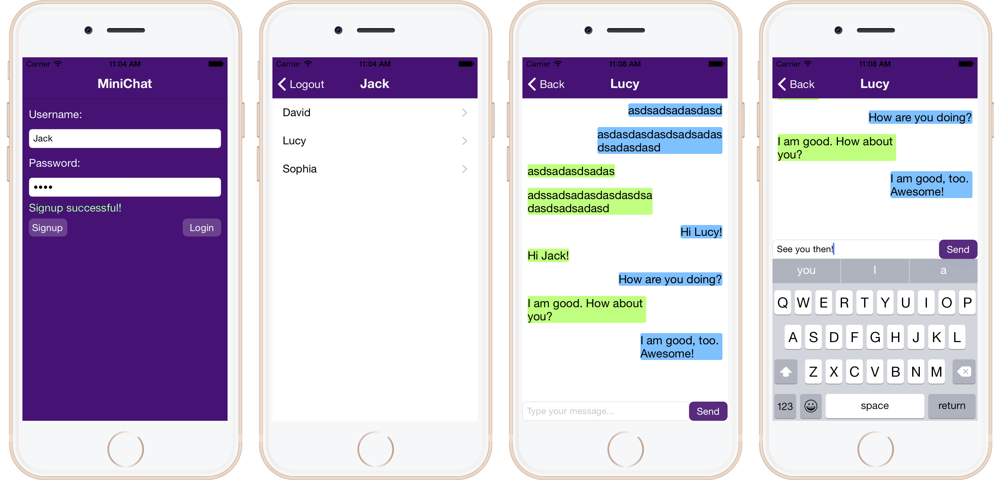

#iOS Messaging App Tutorial

In this tutorial, you will learn how to use the [Sinch](https://www.sinch.com/) iOS SDK to an build instant messaging app. The estimated time to finish this tutorial is about 1 - 2 hours.

####Prerequisites
 * Solid understanding of basic concepts in Objective-C language and object-oriented programing.
 * Entry level knowledge and experience of developing iOS apps. Familiarity with delegation, storyboard, IBOutlets and IBActions, view controllers and segues, function callback blocks, etc.
 * Access to a Mac Computer with Xcode 6.x installed.
 * Access to one or more iOS 8.x devices is recommended but not required.

####Outcome
By the end of this tutorial, you will have built an instant messaging app that looks like the following.


##Preparation

In addition to the Sinch SDK, we will also use another third party SDK called [Parse](https://parse.com), as a zero-configuration cloud database, to store all the signed-up users and all the historical messages between each pair of users.

**Optional:** as a handy reference, create a new favorite folder named **ios-messaging-tutorial** or **Sinch** in your browser and add the following pages:

 * [iOS messaging tutorial](https://github.com/sinch/ios-messaging-tutorial)
 * [Sinch SDK user guide](https://www.sinch.com/docs/ios/user-guide/)
 * [Sinch SDK reference](https://download.sinch.com/docs/iOS/latest/reference/html/index.html)
 * [Parse SDK quick start guide](https://www.parse.com/apps/quickstart#social/mobile/ios/native/new)
 * [Parse SDK guide](https://www.parse.com/docs/ios_guide#top/iOS)

The whole tutorial app source code can be downloaded at [https://github.com/sinch/ios-messaging-tutorial](https://github.com/sinch/ios-messaging-tutorial). To get you start quickly and focus on how to use the SDKs, a project template **BoilerPlate** is provided for you along with the finished project **iOS-Messaging-tutorial** as the final reference. For this tutorial, we will mainly work with **BoilerPlate**.

To run the both of these projects, make sure you run `pod install` in your project directory. 

##Project Setup

###Template overview
Download/clone the project from [https://github.com/sinch/ios-messaging-tutorial](https://github.com/sinch/ios-messaging-tutorial). You can try the completed MiniChat app first. Under Building Settings pane of the project and all the targets, make sure the value of the **Architectures** key is set to "armv7, armv7s" and **Provisioning Profile** is set to 'Automatic'. Make sure these two keys are correctly set in both the **MiniChat** and the **MiniChatTemplate** projects.


Open the project file *boilerplate/ios-sinch-messaging-tutorial.xcodeproj*. Your Xcode 6.x should be launched now.

Verify that the *iOS Deployment Target* under the **Info** pane in the ios-messaging-tutorial project and the *Deployment Target* under **General** pane in MiniChat target are both '8.0'.


Open *Main.storyboard*, you should see 4 view controllers. The navigation controller is the initial view controller and it contains the other 3 view controllers we will use: the Login View Controller, the Chat Mate List View Controller, and finally the Dialog View Controller, each with a pair of corresponding Objective-C class files as shown in the project navigator on the left. Notice how the 3 view controllers are linked and ordered by two Show Segues (Push Segues).


As you can see in the project navigator, there are 5 classes - AppDelegate, MNCChatMessageCell, MNCLoginViewController, MNCChatMateListViewController, and MNCDialogViewController. They are almost empty except those IBOutlets (UI element connections).


###SDK setup

Let's start with setting up the two SDKs - Sinch and Parse.

####Setting up Sinch

Signup and login to your [Sinch](https://www.sinch.com/) account. In your Dashboard, open the **APPS** pane on the left. Create an app with 'MiniChat' as the name and select sandbox as the environment. Click the keyshape button next to the newly created app. You should see the credentials for your app, which includes the Hostname, the Key and the Secret. Save these 3 strings for later use.

Follow the [First Time Setup section](https://www.sinch.com/docs/ios/user-guide/#firsttimesetup) of Sinch iOS SDK user guide.

Sinch is also available as a [CocoaPods](http://www.cocoapods.org/). So if you are using CocoaPod, which is recommended, simply add the following line to your Podfile:

```pod 'SinchRTC'```

Alternatively, if you don't use CocoaPod, you can manually add the SDK to your project by:

 * Adding Sinch.framework to the **Frameworks** group in the project navigator.
 * Adding Sinch.framework, AudioToolbox.framework, AVFoundation.framework and Security.framework to the **Link Binary With Libraries** list under **Build Phases** pane in the ios-sinch-messaging-tutorial target of your Xcode project.
 * Adding '-ObjC -Xlinker -lstdc++' to **Other Linker Flags** under the **Build Settings** pane in the ios-sinch-messaging-tutorial target.

####Setting up Parse

Signup and login to your [Parse](https://www.parse.com/) account. In your account panel, click the **Select an App** button on the top left corner and then **+ Create App**. Create an app with 'iOS-Messaging-Tutorial' as the name. You should see the app keys. Write down the **Application ID** and the **Client Key** for later use.

Download the [Parse SDK](https://www.parse.com/downloads/ios/parse-starter-project/latest). Drag Parse.framework and Bolts.framework into the **Frameworks** group of your project and make sure they are linked by the application target.

####Your first few lines of code

In Xcode, create a new header file named 'Config.h' and put it in the iOS-Messaging-Tutorial/iOS-Messaging-Tutorial group. We will use this file to keep track of all those weird keys and secrets of the two APIs. Delete all the code lines in Config.h and add the following preprocessor constants (don't forget to replace the example strings with **YOUR OWN** credential strings, later you will login with your own Sinch and Parse dashboards to check your app):

```objective-c
//  Config.h

#define SINCH_APPLICATION_KEY @"your-app-key"

#define SINCH_APPLICATION_SECRET @"your-app-secret"

#define SINCH_ENVIRONMENT_HOST @"sandbox.sinch.com"

#define PARSE_APPLICATION_ID @"your-app-id"

#define PARSE_CLIENT_KEY @"your-client-key"
```

To use the Parse SDK, we need to initialize it every time when the application starts. So add the line

```objective-c
#import <Parse/Parse.h>
#import "Config.h"
```

near the top of **AppDelegate.h**. And add the line

```objective-c
[Parse setApplicationId:PARSE_APPLICATION_ID clientKey:PARSE_CLIENT_KEY];    
```

into the **application:didFinishLaunchingWithOptions:** function of **AppDelegate.m**, so that it should look like:

```objective-c
@implementation AppDelegate

- (BOOL)application:(UIApplication *)application didFinishLaunchingWithOptions:(NSDictionary *)launchOptions {
    // Override point for customization after application launch.
    [Parse setApplicationId:PARSE_APPLICATION_ID clientKey:PARSE_CLIENT_KEY];    /* add this line */
    
    return YES;
}

@end
```

## Implementing The Login Scene

The Login Scene is the first scene of the app and it is for a user to sign up for a new account or login with an existing account.

When the Login Scene initializes, we need to set the title of the scene as 'ios-sinch-messaging-tutorial' and hide the prompt label since no error message needs to be shown yet. Add the following **viewDidLoad** method to implementation of **MNCLoginViewController.m** (use **[#pragma mark](http://stackoverflow.com/questions/6853821/what-is-the-significance-of-pragma-marks-why-do-we-need-pragma-marks)** directive to group methods):

```objective-c
@implementation MNCLoginViewController

#pragma mark Boilerplate methods

- (void)viewDidLoad {
    [super viewDidLoad];
    // Do any additional setup after loading the view, typically from a nib.
    
    self.navigationItem.title = @"ios-sinch-messaging-tutorial";
    self.promptLabel.hidden = YES;
}

@end
```

When a user inputs text into the username field or password field, the virtual keyboard may overlap any textfield or button. We need to hide the virtual keyboard when the user taps the main view (or any non-UIControl elements). So add the following method in the **MNCLoginViewController.m** implementation:

```objective-c
@implementation MNCLoginViewController

#pragma mark User interface behavioral methods

// Tab the view to dismiss keyboard
- (void)didTapOnView {
    [self.usernameField resignFirstResponder];
    [self.passwordField resignFirstResponder];
}

@end
```

And add the following two lines before the end of the **viewDidLoad** method:

```objective-c
- (void)viewDidLoad {

    // Tab the view to dismiss keyboard
    UITapGestureRecognizer *tapViewGR = [[UITapGestureRecognizer alloc] initWithTarget:self action:@selector(didTapOnView)];
    [self.view addGestureRecognizer:tapViewGR];
}
```

###Implementing Signup
A new user should be able to sign up by pressing the signup button. For simplicity, a user in this app would only consist of a username and a password. User management in Parse is through the **PFUser** class. And signup can be done with its **signUpInBackgroundWithBlock:** instance method. The prompt label can be used to notify the user if a signup succeeds or display the error message if it fails. Whenever a new user is signed-up, a new user record of your app is automatically created in the Parse server.

Add `#import <Parse/Parse.h>` to **MNCLoginViewController.h**. In the **MNCLoginViewController.m** implementation, create an Touch-Up-Inside IBAction with the Signup button (in the storyboard) and name it **signup**. Put the following code inside this function (remember to use **weak reference** to self inside a call back block to avoid potential strong reference cycle):

```objective-c
@implementation MNCLoginViewController

#pragma mark Functional methods

- (IBAction)signup:(id)sender {
    PFUser *pfUser = [PFUser user];
    pfUser.username = self.usernameField.text;
    pfUser.password = self.passwordField.text;
    
    __weak typeof(self) weakSelf = self;
    [pfUser signUpInBackgroundWithBlock:^(BOOL succeeded, NSError *error) {
        if (!error) {
            weakSelf.promptLabel.textColor = [UIColor greenColor];
            weakSelf.promptLabel.text = @"Signup successful!";
            weakSelf.promptLabel.hidden = NO;
        } else {
            weakSelf.promptLabel.textColor = [UIColor redColor];
            weakSelf.promptLabel.text = [error userInfo][@"error"];
            weakSelf.promptLabel.hidden = NO;
        }
    }];
}

@end
```

###Implementing Login
Login can be done with the **logInWithUsernameInBackground:password:block:** class method of **PFUser**. If login fails, show the error message with the prompt label; if login succeeds, proceed to next scene - the Chat Mate List Scene managed by the MNCChatMateListViewController. Notice that the transition from MNCLoginViewController to MNCChatMateListViewController is done by a storyboard segue with the identifier 'LoginSegue'. In order to invoke execute this transition, we need to call the **performSegueWithIdentifier:sender** from the source view controller.

In the **MNCLoginViewController.m** implementation, under `#pragma mark Functional methods`, create an Touch-Up-Inside IBAction with the Login button and name it **login**. Add the following code:

```objective-c
@implementation MNCLoginViewController

#pragma mark Functional methods

- (IBAction)login:(id)sender {
    __weak typeof(self) weakSelf = self;
    [PFUser logInWithUsernameInBackground:self.usernameField.text
                                 password:self.passwordField.text
                                    block:^(PFUser *pfUser, NSError *error)
    {
        if (pfUser && !error) {
            // Proceed to next screen after successful login.
            weakSelf.promptLabel.hidden = YES;
            [weakSelf performSegueWithIdentifier:@"LoginSegue" sender:self];
        } else {
            // The login failed. Show error.
            weakSelf.promptLabel.textColor = [UIColor redColor];
            weakSelf.promptLabel.text = [error userInfo][@"error"];
            weakSelf.promptLabel.hidden = NO;
        }
    }];
}

@end
```

Now, if you run and test the app, you should be able to signup with the Signup button and to login with the Login button. If the login succeeded without error, you should have gone to the almost empty Chat Mate List Scene.

Next we will begin to work on our Chat Mate List Scene. I hope you are feeling good or excited by following this tutorial to build the app.

##Implementing the Chat Mate List Scene

As an instant messaging app, we want to be able to message to other users - who are referred to as **chat mates** in this app. Most of the time, we want to be able to choose a particular chat mate to chat with at certain moment. And that's what the Chat Mate List Scene does - to show you a list of available chat mates for you to choose. For this app, we will simply just display all the signed-up users in the list.

Clearly, it wouldn't make sense to display the user himself/herself in his/her chat mate list. And the app should be able to identify and keep track of the currently logged-in user. We can reach this by creating a property called **myUserId** and pass the username string value to it when the user logins. So myUserId would be an NSString and it should be public/exposed. In the **MNCChatMateListViewController.h**, add the following line:

```objective-c
@interface MNCChatMateListViewController : UITableViewController

@property (strong, nonatomic) NSString *myUserId;   /* add this line */

@end
```

In order to pass data through the LoginSegue, we need to implement the **prepareForSegue** method in the source view controller - MNCLoginViewController. This method would be called right before any segue is executed. It is common practice to distinguish each segue by checking the segue identifier. Go back to the **MNCLoginViewController.m**, under `#pragma mark Boilerplate methods`, add the following code: (Don't forget to add `#import "MNCChatMateListViewController.h"` to **MNCLoginViewController.h** first):

```objective-c
@implementation MNCLoginViewController

#pragma mark Boilerplate methods

- (void)prepareForSegue:(UIStoryboardSegue *)segue sender:(id)sender {
    if ([segue.identifier isEqualToString:@"LoginSegue"]) {
        MNCChatMateListViewController *destViewController = segue.destinationViewController;
        destViewController.myUserId = self.usernameField.text;
    }
}

@end
```

Now when the LoginSegue is performed and the MNCChatMateListViewController is loaded into memory, the myUserId property will be properly initialized. We can set the title of the Chat Mate List Scene as myUserId. Add the following code to the **MNCChatMateListViewController.m** implementation:

```objective-c
@implementation MNCChatMateListViewController

#pragma mark Boilerplate methods

- (void)viewDidLoad {
    [super viewDidLoad];
    
    self.navigationItem.title = self.myUserId;
}

@end
```

When the users logs out, before MNCChatMateListViewController will be removed, you need to log out the current Parse user account by calling `[PFUser logOut];`. So add `#import <Parse/Parse.h>` to **MNCChatMateListViewController.h**, then add the **dealloc** method under `#pragma mark Boilerplate methods` in **MNCChatMateListViewController.m** implementation:

```objective-c
@implementation MNCChatMateListViewController

#pragma mark Boilerplate methods

- (void)dealloc {
    //Logout current user
    [PFUser logOut];
}

@end
```

###Displaying the list of chat mates
Notice that MNCChatMateListViewController is a subclass of UITableViewController. We could just use its main view - a UITableView, to display the chat mate list. In order to do that, two things are needed: 

1. An NSMutableArray needs to be defined in MNCChatMateListViewController to store an array of chat mates. (Recall the Model-View-Controller design pattern. In this case the array is the model; the UITableView is the view; and MNCChatMateListViewController is the controller.)

2. MNCChatMateListViewController needs to adopt \<UITableViewDataSource\> protocol in order to 'provide' the data source to the its UITableView.

The NSMutableArray will store the username (userid) of each user. It doesn't need to be public/exposed at this point. So we can just put it in the class extension in **MNCChatMateListViewController.m**:

```objective-c
@interface MNCChatMateListViewController ()

@property (strong, nonatomic) NSMutableArray *chatMatesArray;

@end
```

Whenever you declare an NSMutableArray (or any other Cocoa collection objects), don't forget to initialize it before manipulating its elements. If you forget this, it may cost you a long time to debug. So add the following line before the end of the **viewDidLoad** method:

```objective-c
- (void)viewDidLoad {
    ...

    self.chatMatesArray = [[NSMutableArray alloc] init];
}
```

Next, add \<UITableViewDataSource\> protocol to **MNCChatMateListViewController.h** to the end of the **@interface** line, as follows:

```objective-c
@interface MNCChatMateListViewController : UITableViewController <UITableViewDataSource>
```

And add the following three methods in the **MNCChatMateListViewController.m** implementation (notice that the prototype cell in the table view of MNCChatMateListViewController is an instance of UITableViewCell and it has the identifier 'ChatMateListPrototypeCell'):

```objective-c
@implementation MNCChatMateListViewController

#pragma mark UITableViewDataSource protocol methods

- (NSInteger)numberOfSectionsInTableView:(UITableView *)tableView
{
    // Return the number of sections.
    return 1;
}

- (NSInteger)tableView:(UITableView *)tableView numberOfRowsInSection:(NSInteger)section
{
    // Return the number of rows in the section.
    return [self.chatMatesArray count];
}

- (UITableViewCell *)tableView:(UITableView *)tableView cellForRowAtIndexPath:(NSIndexPath *)indexPath
{
    UITableViewCell *cell = [tableView dequeueReusableCellWithIdentifier:@"ChatMateListPrototypeCell" forIndexPath:indexPath];
    NSString *chatMateId = [self.chatMatesArray objectAtIndex:indexPath.row];
    cell.textLabel.text = chatMateId;
    
    return cell;
}

@end
```

Every time the MNCChatMateListController shows up, we want it to retrieve all the usernames (except myUserId) from the Parse server, store them to `chatMatesArray` and finally display them to its table view. Data is stored in the Parse server as 'objects' and it is retrieved through PFQuery. Users are a special type of Parse object (instance of PFUser) and hence they have a special type of query. Add the following code in MNCChatMateListViewController.m implementation (notice how myUserId is filtered out):

```objective-c
@implementation MNCChatMateListViewController

#pragma mark Functional methods

// Retrieve the full list of chat mates from Parse server
- (void)retrieveChatMatesFromParse {
    [self.chatMatesArray removeAllObjects];
    
    PFQuery *query = [PFUser query];
    [query orderByAscending:@"username"];
    [query whereKey:@"username" notEqualTo:self.myUserId];
    
    __weak typeof(self) weakSelf = self;
    [query findObjectsInBackgroundWithBlock:^(NSArray *chatMateArray, NSError *error) {
        if (!error) {
            for (int i = 0; i < [chatMateArray count]; i++) {
                [weakSelf.chatMatesArray addObject:chatMateArray[i][@"username"]];
            }
            [weakSelf.tableView reloadData];
        } else {
            NSLog(@"Error: %@", error.description);
        }
    }];   
}

@end
```

Next, add the following **viewWillAppear:** function under `#pragma mark Boilerplate methods` in MNCChatMateListViewController.m implementation:

```objective-c
@implementation MNCChatMateListViewController

#pragma mark Boilerplate methods

- (void)viewWillAppear:(BOOL)animated {
    [super viewWillAppear:animated];
    
    [self retrieveChatMatesFromParse];
}

@end
```

The reason why `[self retrieveChatMatesFromParse];` is added into **viewWillAppear:** instead of **viewDidLoad** is that we want to refresh the chat mate list whenever the chat mate list scene appears. It could be when the user logs in, or when the user returns from the Dialog Scene. Being in **viewWillAppear:**, **retrieveChatMatesFromParse** will get called more often and the app will try to 'discover' newly signed-up chat mates more often. Now if you test the app, after you logged-in you will see a scrollable list of all other users.

###Opening a dialog

Notice that the segue that connects from MNCChatMateListViewController to MNCDialogViewController has an identifier as 'OpenDialogSegue' and it is triggered by the ChatMateListPrototypeCell, which means that whenever a ChatMateListPrototypeCell is tapped, the OpenDialogSegue is triggered and performed, and the Dialog Scene will be loaded.

So next we will begin to work with the Dialog Scene as well as the unfinished Chat Mate List Scene. You may notice that we haven't really used the Sinch API yet. Be patient! We will reach that soon.

##Setting up the Dialog Scene - Part 1

The Dialog Scene, managed by MNCDialogViewController, is where the user edits and sends messages to a particular chat mate, and reads all the historical messages between them. **messageEditField** is where the user edits the message to be sent. **historicalMessagesTableView** is where historical messages are displayed.

First thing we want the Dialog Scene to do is to display the chat mate ID as its title. To do this, we can simply declare an NSString type public property **chatMateId** in MNCDialogViewController and initialize its values through the OpenDialogSegue. Notice here we also declare a private property called **activeDialogViewController** and changes its value accordingly. It is used to keep track of to whom the user is currently engaged in a dialog with. You will see how useful it is later. Then we set the scene title as chatMateId in the **viewDidLoad** method.


```objective-c
// MNCDialogViewController.h

@interface MNCDialogViewController : UIViewController

@property (strong, nonatomic) NSString *chatMateId;     /* add this line */

@end
```

Add `#import "MNCDialogViewController.h"` to **MNCChatMateListViewController.h**. Then add the following to **MNCChatMateListViewController.m**:

```objective-c
// MNCChatMateListViewController.m

@interface MNCChatMateListViewController ()

@property (strong, nonatomic) MNCDialogViewController *activeDialogViewController;  /* add this line */

@end


@implementation MNCChatMateListViewController

#pragma mark Boilerplate methods

- (void)viewWillAppear:(BOOL)animated {
    [super viewWillAppear:animated];
    
    self.activeDialogViewController = nil;  /* add this line */
    [self retrieveChatMatesFromParse];
}

- (void)prepareForSegue:(UIStoryboardSegue *)segue sender:(id)sender {
    // Segue to open a dialog
    if ([segue.identifier isEqualToString:@"OpenDialogSegue"]) {
        self.activeDialogViewController = segue.destinationViewController;
        NSInteger chatMateIndex = [[self.tableView indexPathForCell:(UITableViewCell *)sender] row];
        self.activeDialogViewController.chatMateId = self.chatMatesArray[chatMateIndex];
        return;
    }
}

@end
```

```objective-c
// MNCDialogViewCtonroller.m

@implementation MNCDialogViewController

#pragma mark Boilerplate methods

- (void)viewDidLoad {
    [super viewDidLoad];
    
    self.navigationItem.title = self.chatMateId;
}

@end
```


###Using \<SINClient\>

Recall that messaging is the responsibility of the Sinch API. To send a message, we need a 'SINMessageClient', an object that adopts the \<SINMessageClient\> protocol. The good news is that we can get a 'SINMessageClient' from a 'SINClient', an object that adopts \<SINClient\> protocol, because \<SINClient\> protocol has a method called **messageClient** that returns a id\<SINMessageClient\>. So we need a id\<SINClient\> object, which is initialized through the **clientWithApplicationKey:applicationSecret:environmentHost:userId:** class method of the **Sinch** class. Notice from the method signature that in order for an id\<SINClient\> to be initialized, you not only need the Application Key, the Application Secret and the Environment Host, all the three things you had written down. But you also need to provide a user ID. One way of doing this is is to declare a property called **id\<SINClient\> sinchClient** in **AppDelegate.h** and initialize sinchClient in the loginMethod Method

First thing first, add `#import <Sinch/Sinch.h>` to **AppDelegate.h**.

Then, add the **id\<SINClient\> sinchClient** property:

```objective-c
@property (strong, nonatomic) id<SINClient> sinchClient;
@end
```

####Initializing Sinch
Next, to initialize sinchClient, add `#import "Config.h"` to **AppDelegate.h**. Then add the following **initSinchClient** method into the **AppDelegate.m** implementation:

```objective-c
@implementation AppDelegate

#pragma mark Functional methods

// Initialize the Sinch client
- (void)initSinchClient:(NSString*)userId {
    self.sinchClient = [Sinch clientWithApplicationKey:SINCH_APPLICATION_KEY
                            applicationSecret:SINCH_APPLICATION_SECRET
                                  environmentHost:SINCH_ENVIRONMENT_HOST
                                       userId:userId];
    NSLog(@"Sinch version: %@, userId: %@", [Sinch version], [self.sinchClient userId]);
    
    [self.sinchClient setSupportMessaging:YES];
    [self.sinchClient start];
    [self.sinchClient startListeningOnActiveConnection];
}

@end
```

And call the above method before the end of the **login:** method of MNCLoginViewController.

Add import toMNCLogonViewController.m 

```objective-c
#import "AppDelegate.h"
```

Change the **login:** method to look like this:

```objective-c
- (IBAction)login:(id)sender {
    __weak typeof(self) weakSelf = self;
    [PFUser logInWithUsernameInBackground:self.usernameField.text
                                 password:self.passwordField.text
                                    block:^(PFUser *pfUser, NSError *error)
     {
         if (pfUser && !error) {
             // Proceed to next screen after successful login.
             weakSelf.promptLabel.hidden = YES;
             //add this
             AppDelegate *appDelegate = (AppDelegate *)[[UIApplication sharedApplication] delegate];
             [appDelegate initSinchClient:self.usernameField.text];
             //
             [weakSelf performSegueWithIdentifier:@"LoginSegue" sender:self];
          
             
         } else {
             // The login failed. Show error.
             weakSelf.promptLabel.textColor = [UIColor redColor];
             weakSelf.promptLabel.text = [error userInfo][@"error"];
             weakSelf.promptLabel.hidden = NO;
         }
     }];
}

```

####Listening SinchClient events
In order to be notified of some important state change events of **sinchClient**, perhaps for debugging purposes, it is a good idea to make the MNCChatMateListViewController adopt the \<SINClientDelegate\> protocol. So add the protocol to **AppDelegate.h**; when sinchClient is initialized, set the MNCChatMateListViewController instance as its delegate; and add two methods into **AppDelegate.m**:

```objective-c
// AppDelegate.h

@interface AppDelegate : 
	UIResponder <UIApplicationDelegate, SINClientDelegate>

@end
```

In initSinchClient add after the initialization

```
    self.sinchClient.delegate = self;   /* add this line */
```

Add the protocol implementation for **SINCLientDelegate**

```objective-c
// AppDelegate.m

#pragma mark SINClientDelegate methods

- (void)clientDidStart:(id<SINClient>)client {
    NSLog(@"Start SINClient successful!");
}

- (void)clientDidFail:(id<SINClient>)client error:(NSError *)error {
    NSLog(@"Start SINClient failed. Description: %@. Reason: %@.", error.localizedDescription, error.localizedFailureReason);
}

@end
```

###Using \<SINMessageClient\>

The id\<SINMessageClient\> object and its delegate together are responsible for doing the most important thing - sending a message, receiving a message, being notified that a message is sent, being notified that a message is delivered, being notified a message sending failure, etc. Essentially, we now already have an id\<SINMessageClient\> in MNCChatMateListViewController by having a sinchClient which can call its **messageClient** method to return an id\<SINMessageClient\>. But it definitely worth some consideration about where to place these two object to perform those actions or listen to those events.

In a real world app scenario you would probably have a separate like service class that uses NotificationCenter to broadcast events. In this tutorial we are going to put most of that code in AppDelegate. 

Let's start implementing message events.

In Config.h add the following, later we are going to use those as names for broadcasting events. The reason for using Notification center is that we want to be able to handle and notify different view controllers about messages being sent and received. 


```
#define SINCH_MESSAGE_RECIEVED @"SINCH_MESSAGE_RECIEVED"
#define SINCH_MESSAGE_SENT @"SINCH_MESSAGE_SENT"
#define SINCH_MESSAGE_DELIVERED @"SINCH_MESSAGE_DELIVERED"
#define SINCH_MESSAGE_FAILED @"SINCH_MESSAGE_DELIVERED"
``` 

In AppDelegate.h add SINMessageClientDelegate protocol:

```
@interface AppDelegate : UIResponder <UIApplicationDelegate, SINClientDelegate, SINMessageClientDelegate>
```

Add a property for the message client (don't forget to @syntezise):

```
@property (strong, nonatomic) id<SINMessageClient> sinchMessageClient;
```

Open up AppDelegate.m in clientDidStart and add the code below to assign the property and delegate

```
- (void)clientDidStart:(id<SINClient>)client {
    NSLog(@"Start SINClient successful!");
    self.sinchMessageClient = [self.sinchClient messageClient];
    self.sinchMessageClient.delegate =  self;
}

```

In AppDelegate.m add protocol methods for listening on SINMessageClient and broad cast them in notification center. 

```
#pragma mark SINMessageClientDelegate methods
// Receiving an incoming message.
- (void)messageClient:(id<SINMessageClient>)messageClient didReceiveIncomingMessage:(id<SINMessage>)message {
   [[NSNotificationCenter defaultCenter] postNotificationName:SINCH_MESSAGE_RECIEVED object:self userInfo:@{@"message" : message}];   
}

// Finish sending a message
- (void)messageSent:(id<SINMessage>)message recipientId:(NSString *)recipientId {
	[[NSNotificationCenter defaultCenter] postNotificationName:SINCH_MESSAGE_SENT object:self userInfo:@{@"message" : message}];
    
}

// Failed to send a message
- (void)messageFailed:(id<SINMessage>)message info:(id<SINMessageFailureInfo>)messageFailureInfo {
	[[NSNotificationCenter defaultCenter] postNotificationName:SINCH_MESSAGE_FAILED object:self userInfo:@{@"message" : message}];
    NSLog(@"MessageBoard: message to %@ failed. Description: %@. Reason: %@.", messageFailureInfo.recipientId, messageFailureInfo.error.localizedDescription, messageFailureInfo.error.localizedFailureReason);
}

-(void)messageDelivered:(id<SINMessageDeliveryInfo>)info
{
    [[NSNotificationCenter defaultCenter] postNotificationName:SINCH_MESSAGE_FAILED object:info];
}

```

###Sending messages

First, define a sendTextMessage:toRecipient: public instance method in AppDelegate.h. This method would invoke the sendMessage: API method of the sinchClient.messageClient object.

```
- (void)sendTextMessage:(NSString *)messageText toRecipient:(NSString *)recipientID;   
```

AppDelegate.m

```objective-c

#pragma mark Functional methods

// Send a text message
- (void)sendTextMessage:(NSString *)messageText toRecipient:(NSString *)recipientId {
    SINOutgoingMessage *outgoingMessage = [SINOutgoingMessage messageWithRecipient:recipientId text:messageText];
    [self.sinchClient.messageClient sendMessage:outgoingMessage];
}

@end
```

Before we start building the UI, let's implement saving and retrieving messages from Parse. Sinch will save messages for delivery by default for 30 days, but don't provide a storage to query and sync at will. If a user adds a new device or reinstalls the client, messages will be delivered again. So if you want to support full history as we do you need to either use your own backend or Parse.

In AppDelegate, add an instance method called **saveMessagesOnParse**, 

```objectivec
- (void)saveMessagesOnParse:(id<SINMessage>)message {
    PFQuery *query = [PFQuery queryWithClassName:@"SinchMessage"];
    [query whereKey:@"messageId" equalTo:[message messageId]];

    [query findObjectsInBackgroundWithBlock:^(NSArray *messageArray, NSError *error) {
        if (!error) {
            // If the SinchMessage is not already saved on Parse (an empty array is returned), save it.
            if ([messageArray count] <= 0) {
                PFObject *messageObject = [PFObject objectWithClassName:@"SinchMessage"];

                messageObject[@"messageId"] = [message messageId];
                messageObject[@"senderId"] = [message senderId];
                messageObject[@"recipientId"] = [message recipientIds][0];
                messageObject[@"text"] = [message text];
                messageObject[@"timestamp"] = [message timestamp];

                [messageObject saveInBackground];
            }
        } else {
            NSLog(@"Error: %@", error.description);
        }
    }];
}
```

In messageSent: and didReceiveIncomingMessage, add a call to the saveMessageOnParse, they should look like this when you are done:

```objectivec
// Receiving an incoming message.
- (void)messageClient:(id<SINMessageClient>)messageClient didReceiveIncomingMessage:(id<SINMessage>)message {
    [self saveMessagesOnParse:message];
    [[NSNotificationCenter defaultCenter] postNotificationName:SINCH_MESSAGE_RECIEVED object:message];
}

// Finish sending a message
- (void)messageSent:(id<SINMessage>)message recipientId:(NSString *)recipientId {
        [self saveMessagesOnParse:message];
    [[NSNotificationCenter defaultCenter] postNotificationName:SINCH_MESSAGE_SENT object:message];
    
}
```

Now all the sent or received messages should be saved in Parse without a problem. Run your app and send some messages. In the browser, go to your Parse dashboard, open your app, click the Core pane button on the top and then the Data tab button on the left. You should be able to see every saved message object.


##Implementing the UI
Open up **MNCDialogViewController.h**, and add a property called messageArray and init in viewDidLoad. It should now look like this:

```objectivec
- (void)viewDidLoad {
    [super viewDidLoad];
    self.navigationItem.title = self.chatMateId;
    self.messageArray = [[NSMutableArray alloc] init];
}
```

Any historical messages between the user and the current specific chat mate that are retrieved will be added to self.messageArray. How do we differentiate which ones are sent by the chat mate and which ones are sent by the user? We can imitate most other messaging apps. We can show chat mate sent messages on the left and user sent messages on the right, and we use different colors for them. If you look at the storyboard, a custom prototype cell in the table view has been created for that purpose, and its custom class - MNCChatMessageCell is given. 

MNCChatMessageCell has two more properties compared to its superclass, the UITableViewCell - chatMateMessageLabel and myMessageLabel. So your app just needs to determine which label to put a message object into at run time.

Every time the MNCDialogViewController load its view, it should retrieve the historical messages from Parse. While messages are retrieved by PFQuery that returns PFObject instances, we would like to add id<SINMessage> into messageArray. 

Since properties declared in <SINMessag> protocol are all read-only, which stops us from setting each property according to the PFObject, we can create a class that adopts <SINMessag> protocol.

Create an Objective-C class (Cocoa class) named MNCChatMessage that subclasses NSObject and adopts <SINMessage> protocol. The .h and .m file should look as follows:

```objectivec
// MNCChatMessage.h

#import <Foundation/Foundation.h>
#import <Sinch/Sinch.h>

@interface MNCChatMessage : NSObject <SINMessage>

@property (nonatomic, strong) NSString* messageId;

@property (nonatomic, strong) NSArray* recipientIds;

@property (nonatomic, strong) NSString* senderId;

@property (nonatomic, strong) NSString* text;

@property (nonatomic, strong) NSDictionary* headers;

@property (nonatomic, strong) NSDate* timestamp;

@end
```

```objectivec
// MNCChatMessage.m

#import "MNCChatMessage.h"

@implementation MNCChatMessage

@end
```

Now, add `#import "MNCChatMessage.h"` to **MNCDialogViewController.h**. Then, add the following **retrieveMessagesFromParseWithChatMateID** method and call it in `viewDidLoad:`

```objectivec
[self retrieveMessagesFromParseWithChatMateID:self.chatMateId]; 
```

Next add **retrieveMessagesFromParseWithChatMateID** as below:

```objectivec
- (void)retrieveMessagesFromParseWithChatMateID:(NSString *)chatMateId {
    NSArray *userNames = @[self.myUserId, chatMateId];

    PFQuery *query = [PFQuery queryWithClassName:@"SinchMessage"];
    [query whereKey:@"senderId" containedIn:userNames];
    [query whereKey:@"recipientId" containedIn:userNames];
    [query orderByAscending:@"timestamp"];

    __weak typeof(self) weakSelf = self;
    [query findObjectsInBackgroundWithBlock:^(NSArray *chatMessageArray, NSError *error) {
        if (!error) {
            // Store all retrieve messages into messageArray
            for (int i = 0; i < [chatMessageArray count]; i++) {
                MNCChatMessage *chatMessage = [[MNCChatMessage alloc] init];

                [chatMessage setMessageId:chatMessageArray[i][@"messageId"]];
                [chatMessage setSenderId:chatMessageArray[i][@"senderId"]];
                [chatMessage setRecipientIds:[NSArray arrayWithObject:chatMessageArray[i][@"recipientId"]]];
                [chatMessage setText:chatMessageArray[i][@"text"]];
                [chatMessage setTimestamp:chatMessageArray[i][@"timestamp"]];

                [weakSelf.messageArray addObject:chatMessage];
            }
            [weakSelf.historicalMessagesTableView reloadData];  // Refresh the table view
            [weakSelf scrollTableToBottom];  // Scroll to the bottom of the table view
        } else {
            NSLog(@"Error: %@", error.description);
        }
    }];
}
```

Notice we need to use the property myUserId when retrieving historical messages and we haven't declared it yet. Let's declare it and pass value to it in the OpenDialogSegue:


```objectivec
@interface MNCDialogViewController : UIViewController
@property (strong, nonatomic) NSString *myUserId;   /* add this line */
@end
```

And in MNCChatMatesController:

```
- (void)prepareForSegue:(UIStoryboardSegue *)segue sender:(id)sender {
    // Segue to open a dialog
    if ([segue.identifier isEqualToString:@"OpenDialogSegue"]) {
        self.activeDialogViewController = segue.destinationViewController;
        NSInteger chatMateIndex = [[self.tableView indexPathForCell:(UITableViewCell *)sender] row];
        self.activeDialogViewController.chatMateId = self.chatMatesArray[chatMateIndex];
        self.activeDialogViewController.myUserId = self.myUserId;   /* add this line */
        return;
    }
}

```

Next we need to configure historicalMessagesTableView to display all the messages and define the **scrollTableToBottom** method. Specifically, MNCDialogViewController should adopt \<UITableViewDataSource\> protocol. Add the following code:

```objective-c
//  MNCDialogViewController.h

#import "MNCChatMessageCell.h"  /* add this line */

@interface MNCDialogViewController : UIViewController <UITableViewDataSource>   /* add this protocol */

```

Now in **MNCDialogViewController.m**, add TableViewDelegate methods:

```objective-c
// MNCDialogViewController.m

@implementation MNCDialogViewController

#pragma mark User interface behavioral methods

- (NSInteger)numberOfSectionsInTableView:(UITableView *)tableView
{
    // Return the number of sections.
    return 1;
}

- (NSInteger)tableView:(UITableView *)tableView numberOfRowsInSection:(NSInteger)section
{
    // Return the number of rows in the section.
    return [self.messageArray count];
}


- (UITableViewCell *)tableView:(UITableView *)tableView cellForRowAtIndexPath:(NSIndexPath *)indexPath
{
    MNCChatMessageCell *messageCell = [tableView dequeueReusableCellWithIdentifier:@"MessageListPrototypeCell" forIndexPath:indexPath];
    [self configureCell:messageCell forIndexPath:indexPath];
    
    return messageCell;
}


#pragma mark Method to configure the appearance of a message list prototype cell

- (void)configureCell:(MNCChatMessageCell *)messageCell forIndexPath:(NSIndexPath *)indexPath {
    
    MNCChatMessage *chatMessage = self.messageArray[indexPath.row];
    
    if ([[chatMessage senderId] isEqualToString:self.myUserId]) {
        // If the message was sent by myself
        messageCell.chatMateMessageLabel.text = @"";
        messageCell.myMessageLabel.text = chatMessage.text;
    } else {
        // If the message was sent by the chat mate
        messageCell.myMessageLabel.text = @"";
        messageCell.chatMateMessageLabel.text = chatMessage.text;
    }
}
```

##Sending your first message
Open up Main.storyboard and add an Action for the SendButton of the DialogViewController view:

`- (IBAction)sendMessage:(id)sender;`

In DialogViewController.m, add `#import "AppDelegate.h"`. Then, add implementation for the **sendMessage** action:

```objectivec
-(void)sendMessage:(id)sender
{
      AppDelegate *appDelegate = (AppDelegate *)[[UIApplication sharedApplication] delegate];
    [appDelegate sendTextMessage:self.messageEditField.text toRecipient:self.chatMateId];
}
```

That's it. Now you should be able to send messages. 

Now, when MNCDialogViewContoller loads its view, it should retrieve and display all the historical messages stored at the Parse server. Next we will implement NSNotfications for all the message events we raise in **AppDelegate** 

In viewWillApear add the following:

```objectivec
-(void)viewWillAppear:(BOOL)animated
{
    [[NSNotificationCenter defaultCenter] addObserver:self selector:@selector(messageDelivered:) name:SINCH_MESSAGE_RECIEVED object:nil];
    [[NSNotificationCenter defaultCenter] addObserver:self selector:@selector(messageDelivered:) name:SINCH_MESSAGE_SENT object:nil];
}
```

The reason for putting it in viewVillApear is as soon as the view goes out of view, we don't want to receive notifications about this. Instead we would probably add a listener to the ChatmateController to indicate new messages. 

Make sure to deregister for the notifications when the view will disappear:

```objectivec
-(void)viewWillDisappear:(BOOL)animated
{
    [[NSNotificationCenter defaultCenter] removeObserver:self];
}
```

Add messageDelivered: Method:

```
- (void)messageDelivered:(NSNotification *)notification
{
    MNCChatMessage *chatMessage = [[notification userInfo] objectForKey:@"message"];
    [self.messageArray addObject:chatMessage];
    [self.historicalMessagesTableView reloadData];
    [self scrollTableToBottom];
}
```

##Making the textfield bigger
If you test the app now, you will notice if you send or receive very long messages, the height of the message cell would still be single line. Add the following line of code in **viewDidLoad** to allow for auto-height-adjustment, a feature introduced in iOS 8.

```objective-c
    - (void)viewDidLoad {
    [super viewDidLoad];

    self.navigationItem.title = self.chatMateId;
    self.messageArray = [[NSMutableArray alloc] init];
    // Automatically determine the height of each self-sizing tabel view cells - an iOS 8 feature
    self.historicalMessagesTableView.rowHeight = UITableViewAutomaticDimension;     /* add this line */
    [self retrieveMessagesFromParseWithChatMateID:self.chatMateId];
}
```

##Addressing The Virtual Keyboard Issue

At this point the functionality of MiniChat as a tutorial app is pretty much done. There is a user experience problem - when the user is editing the text and the virtual keyboard pops up, the messageEditField (message edit text field), the send button, or the bottom part of the historicalMessagesTableView may potentially be blocked by the keyboard. To solve this problem we need to do two things:

 1. Dismiss the keyboard when the user taps outside of the messageEditField. This is simple using a gesture recognizer.
 2. When the keyboard is showing, scroll the whole view up above the keyboard. That is why all the MNCDialogViewController UI elements are placed inside a UIScrollView object, which is connected an IBOutlet property called **scrollView**, if you look at the storyboard. And [Apple has provided the discussion and code for implementing this behavior](https://developer.apple.com/library/ios/documentation/StringsTextFonts/Conceptual/TextAndWebiPhoneOS/KeyboardManagement/KeyboardManagement.html#//apple_ref/doc/uid/TP40009542-CH5-SW1#Moving Content That Is Located Under the Keyboard). Just copy-and-paste the following code into **MNCDialogViewController.h** and **MNCDialogViewController.m**. Specifically, MNCDialogViewController needs to adopt the \<UITextFieldDelegate\> protocol:

```objective-c
//  MNCDialogViewController.h

@interface MNCDialogViewController : UIViewController <UITableViewDataSource, UITextFieldDelegate>

```

```objective-c
//  MNCDialogViewController.m

@interface MNCDialogViewController ()

/* add this property to keep track of the active text field */
@property (strong, nonatomic) UITextField *activeTextField;

@end
```

Make your viewDidLoad look like this:

```objectivec
@implementation MNCDialogViewController

- (void)viewDidLoad {
    
    UITapGestureRecognizer *tapTableGR = [[UITapGestureRecognizer alloc] initWithTarget:self action:@selector(didTapOnTableView)];
    [self.historicalMessagesTableView addGestureRecognizer:tapTableGR];
    [self registerForKeyboardNotifications];
}
```

As you see you are missing some methods, lets add those in to the **MNCDialogViewController**

```objectivec

// Setting up keyboard notifications.
- (void)registerForKeyboardNotifications
{
    [[NSNotificationCenter defaultCenter] addObserver:self
                                             selector:@selector(keyboardWasShown:)
                                                 name:UIKeyboardWillShowNotification object:nil];
    [[NSNotificationCenter defaultCenter] addObserver:self
                                             selector:@selector(keyboardWillBeHidden:)
                                                 name:UIKeyboardWillHideNotification object:nil];
}

// Called when the UIKeyboardDidShowNotification is sent.
- (void)keyboardWasShown:(NSNotification*)aNotification
{
    NSDictionary* info = [aNotification userInfo];
    CGSize kbSize = [[info objectForKey:UIKeyboardFrameEndUserInfoKey] CGRectValue].size;
    UIEdgeInsets contentInsets = UIEdgeInsetsMake(kbSize.height, 0.0, kbSize.height, 0.0);
    self.scrollView.contentInset = contentInsets;
    self.scrollView.scrollIndicatorInsets = contentInsets;
    // If active text field is hidden by keyboard, scroll it so it's visible
    // Your app might not need or want this behavior.
    CGRect aRect = self.view.frame;
    aRect.size.height -= kbSize.height;
    if (!CGRectContainsPoint(aRect, self.activeTextField.frame.origin) ) {
        [self.scrollView scrollRectToVisible:self.activeTextField.frame animated:NO];
    }
}

// Called when the UIKeyboardWillHideNotification is sent
- (void)keyboardWillBeHidden:(NSNotification*)aNotification
{
    UIEdgeInsets contentInsets = UIEdgeInsetsZero;
    self.scrollView.contentInset = contentInsets;
    self.scrollView.scrollIndicatorInsets = contentInsets;
}

#pragma mark UITextFieldDelegate methods

- (void)textFieldDidBeginEditing:(UITextField *)textField
{
    self.activeTextField = textField;
}

- (void)textFieldDidEndEditing:(UITextField *)textField
{
    self.activeTextField = nil;
}

```

##Finish

Finally, you have reached the end of this tutorial. You've built an instant messaging app! 

You may test the app, trying to identify problems if any would exist. Of course, as a tutorial app, it is far from a practical instant messaging app in many aspects. You can modify or expand MiniChat to design your own instant messaging app with some cool new features. 

You may consider other interesting Sinch APIs such as [voice calling](https://www.sinch.com/docs/ios/user-guide/#calling) in the future.

Thanks to Gaunting Liu for his help writing this tutorial. 
